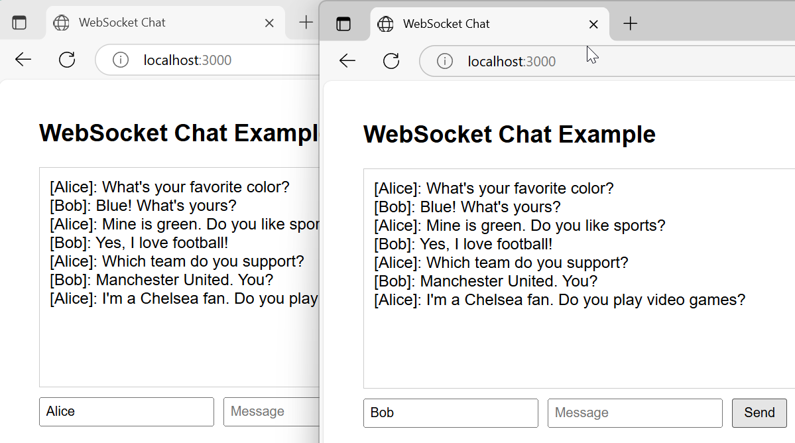

# WebSocket Chat Demo

Este proyecto es una demostración simple de un chat en tiempo real usando WebSockets con Node.js, Express y la librería `ws`. Permite a múltiples usuarios conectarse a través de un navegador web y enviar mensajes que se transmiten a todos los clientes conectados.

## Estructura del proyecto

- `src/index.js`: Servidor Node.js que sirve archivos estáticos y gestiona la comunicación WebSocket.
- `public/index.html`: Interfaz web del chat, implementada en HTML y JavaScript.
- `test/`: Carpeta que contiene pruebas automatizadas con Playwright.
  - `chat.spec.js`: Script de prueba que simula una conversación entre dos usuarios (Alice y Bob) en el chat, automatiza el envío de mensajes y genera capturas de pantalla como evidencia de la ejecución.

## Dependencias

- [express](https://www.npmjs.com/package/express)
- [ws](https://www.npmjs.com/package/ws)

## Dependencias desarrollo
- [playwright](https://www.npmjs.com/package/playwright) (para pruebas automatizadas)

## Instalación

1. Clona este repositorio o descarga los archivos.
2. Instala las dependencias ejecutando:

```bash
npm install
```
Esto instalará las dependencias de express y ws
Adicional para desarrollo instalará la dependencia playwright

## Ejecución

1. Inicia el servidor ejecutando con estas alternativas:

```bash
npm run dev
```
```bash
npm start
```
```bash
node .\src\index.js
```

2. Abre tu navegador y accede a [http://localhost:3000](http://localhost:3000)


## Pruebas automáticas con Playwright

Este proyecto incluye un ejemplo de prueba automatizada usando [Playwright](https://playwright.dev/).

### Ejecutar la prueba

Para ejecutar el archivo de prueba `chat.spec.js`:

```bash
node test/chat.spec.js
```

Esto abrirá un navegador, navegará a una página de ejemplo y tomará una captura de pantalla como demostración.

Puedes modificar `test/chat.spec.js` para agregar más pruebas automatizadas según tus necesidades.

### Evidencia de ejecución

Al ejecutar la prueba automática, se genera una evidencia visual del chat entre dos usuarios (Alice y Bob). Puedes ver el resultado en la siguiente imagen:



Esta imagen muestra cómo se visualiza el chat tras la ejecución del script automatizado.

## ¿Cómo funciona?

- El servidor (`index.js`) sirve la página web y gestiona las conexiones WebSocket.
- Los usuarios ingresan un nombre de usuario y un mensaje en la interfaz web.
- Al enviar un mensaje, este se transmite a todos los clientes conectados en tiempo real.

## Notas

- No se requiere configuración adicional.
- El chat es solo para fines demostrativos y no incluye autenticación ni almacenamiento persistente.
